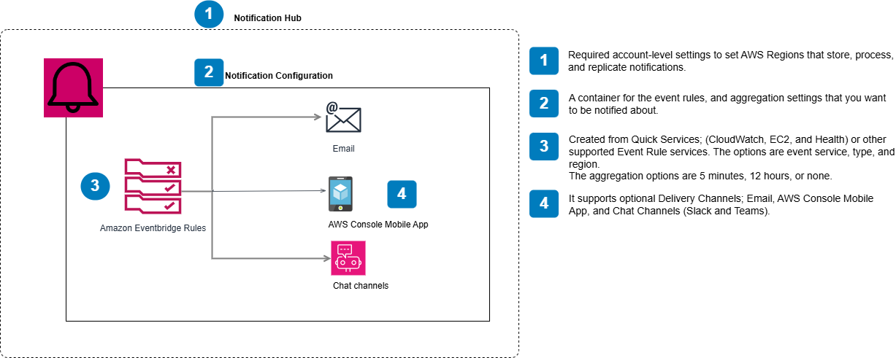

## AWS User Notification

AWS service that acts as a central location for your AWS notifications in the AWS Management Console.
See the architecture below:

## Learn more

### Workshops and tutorials

- [Compare it with SNS and CloudWatch](https://leapingwords.com/aws-user-notifications-vs-cloudwatch-alarm-sns/#The_Comparison)
  
### Documentation

- [What is AWS User Notifications?](https://docs.aws.amazon.com/notifications/latest/userguide/what-is-service.html)
